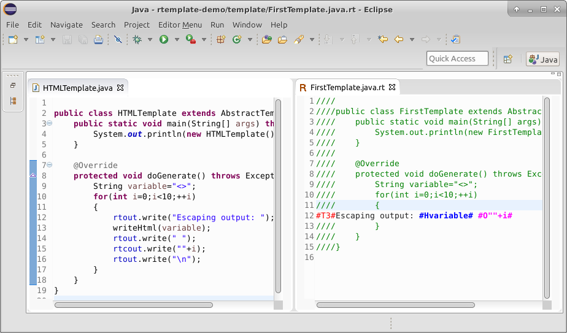

# rtemplate

RTemplate is a simple template language with an Eclipse based editor. It is mainly used in Java to implement code generators and simple HTML generators.



## Features

 * bi-directional mapping between template and plain source code. The template editor edits the template view and the code view side by side. All editing is done in the view that fits better:
  * Output template is written directly into the template view.
  * logic is implemented in Java view: iteration, branches, method call etc.
 * fast - the templates are as fast as possible in the host language (Java, C or else).
 * No runtime dependencies: Templates are pure Java classes without any additional library dependency. A single 25 lines long abstract base class is recommended to be used for a basic implementation of templates.
 * host language independent (string escaping must be compatible with Java). It was used in ANSI C projects besides Java projects.
 * correct whitespace handling. Only whitespaces present in the template are written to the output
 * simple - the implementation is just a few simple Java classes that do dumb text transformation
 * Integrates into Eclipse:
  * There is a coloring editor for template files
  * Builder transforms template view to source code and source code to template view when the file is saved.
  * Refactor support: all refactoring implemented in Eclipse works with template files
 * Template files are simple Java source code. Minor fixes in templates can be done without rtemplate installed. The template view version of the source is normally not version controlled but is an editing time artifact only. We set up the template files to be ignored by the version control system.
 * autoTab (since version 2.0): tabulation of template writing lines in Java source file is automatic


## Caveats
 * Source files must be tabulated using tab (\t) character.
 * Template lines in Java source code must not contain extra whitespace characters: just tabulators on the beginning of the line and no whitespaces between ; and new line character


## Install
 * Use this update site to install RTemplate into Eclipse: http://qgears.com/opensource/updates/
 * In the Install dialog Group items by category must be selected
 * Select Q-Gears tools/RTemplate
 * This installs the hu.rtemplate plugin into your Eclipse instance


## Usage
 * Convert your Java project into an RTemplate project:
  * In project context menu select RTemplate/Convert project to RTemplate
  * This adds the hu.rtemplate.Builder to the project
  * Autobuild must be enabled in Eclipse to use RTemplate in a smooth way.
 * Create rtemplate.conf configuration file into the root folder of the project. Example content:
```
javaDir=src
templateDir=template
```


 * Create the template view of your Java source code:
  * When a Java file is saved then the Eclipse builder automatically creates the template view of that file.
  * project context menu/RTemplate/Convert Java to template batch converts all Java source to its template version
 * Open template file:
  * In the Java code editor context menu select RTemplate/Browse to pair
  * alternatively browse it from the Package Exporer
 * Edit the template file:
  * Saving the template file triggers the builder that overwrites the original Java source file with the version translated from the template source.


## Abstract template base class
 * It is recommended to use an abstract base class for template classes that implements the basic functionality of the template classes.
 * The abstract template base class must have three accessible fields: out, rtout, rtcout which are all references to the same object.
 * An example of such a base class can be found here: https://github.com/qgears/opensource-utils/blob/master/commons/hu.qgears.commons/src/hu/qgears/commons/AbstractTemplate.java

## Overriding built-in tags
 * It is possible to override the built in tags of RTemplate. It is necessary when a different host language is used as template hosting platform (not Java)
 * Example rtemplate.conf file:
```
javaDir=csrc
templateDir=template
codeFileNameSuffix=.c
jTemplatePre=write(out,"
jTemplatePost=");
jOutPre=writeObject(out,
jOutPost=);
```
 * Parameters documentation: https://github.com/qgears/rtemplate/blob/master/hu.rtemplate/src/hu/qgears/rtemplate/TemplateSequences.java


## Using custom tags
 * The template can be extended with custom tags that are compiled to and from custom Java lines that are specific to your project.
 * For example when you are implementing a HTML template you may want to implement a method for printing value of variables through HTML escaping. The example shows how to achieve that:
 * create a method in the template base class that writes a string to the output through escaping:
 * add a custom escape sequence to the rtemplate.conf file:
```
javaDir=src
templateDir=template
tPre0=#H
tPost0=#
jPre0=writeHtml(
jPost0=);
color0=0,0,255
```
 * Note that properties that ends with the same number define the custom tag
  * *tPre[n]* and *tPost[n]* are required parameters, and specify the opening and closing parts of the custom tag in *template view*
  * *jPre[n]* and *jPost[n]* are required parameters, and specify the opening and closing parts of the custom tag in *java code view*
  * *color[n]* is optional, and defines the color of the custom tag in *template view*. Comma separated RGB color coordinates are expected here (between 0 and 255). The default color is 0,0,255.
 * You can define as many custom tags as you want, but the numbering must be continuous 0,1,2...,n 
 * The custom tag is now translated to and from the custom method call in Java.


## Auto tabulation of Java template source code (since version 2.0)

 * In rtemplate.conf the autoTab=true property must be added
 * The #Tx# like tags are omitted from the template code
 * When converting the template lines to Java the following rules are used to determine correct indenting:
   * Normally the indenting (number of tabulators on the line prefix) of the previous line is used for template output lines in Java source generation
   * When a line ends with '{' (ignoring whitespaces but not ignoring comments) then the indenting is incremented by one
 * Example rtemplate.conf file:
```
javaDir=src
templateDir=template
jTemplatePre=write("
jOutPre=writeObject(
autoTab=true
```


